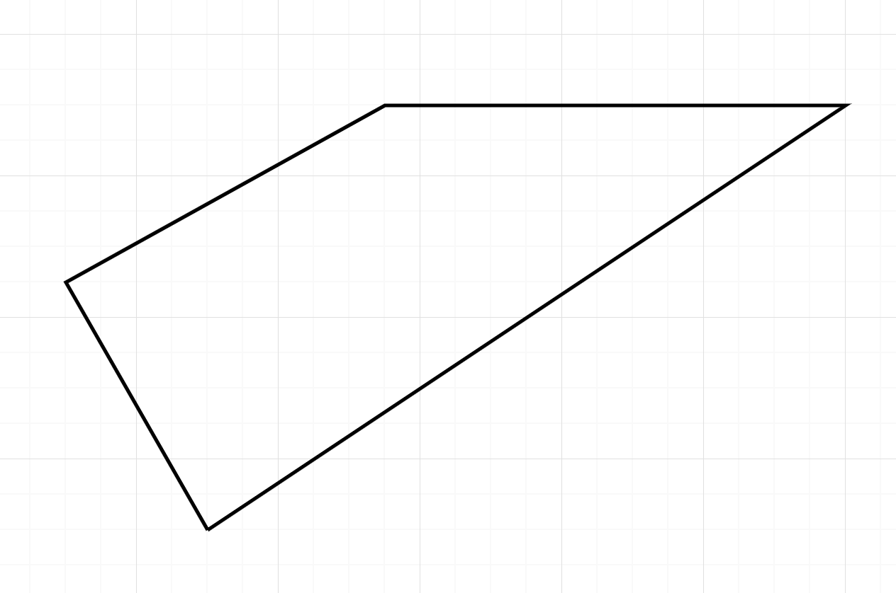
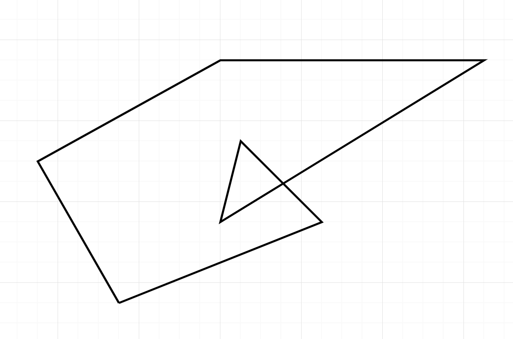

# Intersection polygon detector

This package validate 2D polygon array for self intersecting lines.
Returns `true` if polygon has intersecting lines and `false` if does not.
Does not have any dependencies.
Use case example - coordinates array from goJSON object, validation before saving to DB.
E.g. mongodb will fail on geoJSON query if polygon has self intersecting line.

## Valid polygon example



## Self intersecting polygon example



## How to use this package

### installation

```bash
npm install intersecting-polygon-detector
```

### use

```js
const isPolygonIntersecting = require('intersecting-polygon-detector');
// or
import *  as isPolygonIntersecting from 'intersecting-polygon-detector';

const   validPolygon = [
    [1, 1.5],
    [2, 3],
    [1, -1],
    [-1, -1],
    [-1, 1],
    [-1, 3],
    [1, 1.5],
  ];

  const intersectingPolygon = [
    [1, 1],
    [1, -1],
    [-1, 1],
    [-1, -1],
    [1, 1],
  ];

  isPolygonIntersecting(validPolygon)  // returns false

  isPolygonIntersecting(intersectingPolygon) // returns true

  ```
